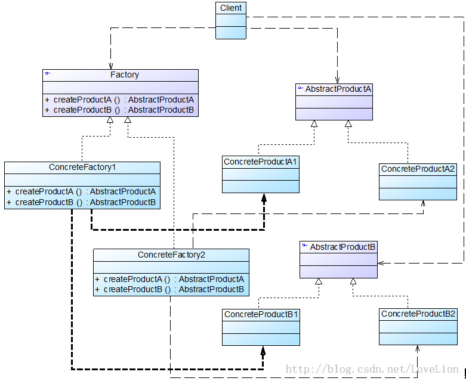

## 工厂三兄弟之抽象工厂模式（三）  

**3 抽象工厂模式概述**  

抽象工厂模式为创建一组对象提供了一种解决方案。与工厂方法模式相比，抽象工厂模式中的具体工厂不只是创建一种产品，它负责创建一族产品。抽象工厂模式定义如下：  

抽象工厂模式（Abstract Factory Pattern）：提供一个创建一系列相关或相互依赖对象的接口，而无须指定它们具体的类。抽象工厂模式又称为 Kit 模式，它是一种对象创建型模式。  

在抽象工厂模式中，每一个具体工厂都提供了多个工厂方法用于产生多种不同类型的产品，这些产品构成了一个产品族，抽象工厂模式结构如图所示：  

   

在抽象工厂模式结构图中包含如下几个角色：  

- **AbstractFactory（抽象工厂）**：它声明了一组用于创建一族产品的方法，每一个方法对应一种产品。  

- **ConcreteFactory（具体工厂）**：它实现了在抽象工厂中声明的创建产品的方法，生成一组具体产品，这些产品构成了一个产品族，每一个产品都位于某个产品等级结构中。  

- **AbstractProduct（抽象产品）**：它为每种产品声明接口，在抽象产品中声明了产品所具有的业务方法。  

- **ConcreteProduct（具体产品）**：它定义具体工厂生产的具体产品对象，实现抽象产品接口中声明的业务方法。  

在抽象工厂中声明了多个工厂方法，用于创建不同类型的产品，抽象工厂可以是接口，也可以是抽象类或者具体类，其典型代码如下所示：  

```
abstract class AbstractFactory {  
public abstract AbstractProductA createProductA(); //工厂方法一  
public abstract AbstractProductB createProductB(); //工厂方法二  
……  
}  
```

具体工厂实现了抽象工厂，每一个具体的工厂方法可以返回一个特定的产品对象，而同一个具体工厂所创建的产品对象构成了一个产品族。对于每一个具体工厂类，其典型代码如下所示：  

```
class ConcreteFactory1 extends AbstractFactory {
    //工厂方法一
public AbstractProductA createProductA() {
    return new ConcreteProductA1();
}

//工厂方法二
public AbstractProductB createProductB() {
    return new ConcreteProductB1();
}

……
}
```

与工厂方法模式一样，抽象工厂模式也可为每一种产品提供一组重载的工厂方法，以不同的方式对产品对象进行创建。  

**思考**  
抽象工厂模式是否符合“开闭原则”？【从增加新的产品等级结构和增加新的产品族两方面进行思考。】