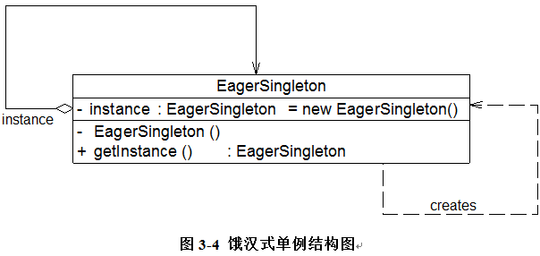

## 确保对象的唯一性——单例模式 （三）  

**4 饿汉式单例与懒汉式单例的讨论**  

Sunny 公司开发人员使用单例模式实现了负载均衡器的设计，但是在实际使用中出现了一个非常严重的问题，当负载均衡器在启动过程中用户再次启动该负载均衡器时，系统无任何异常，但当客户端提交请求时出现请求分发失败，通过仔细分析发现原来系统中还是存在多个负载均衡器对象，导致分发时目标服务器不一致，从而产生冲突。为什么会这样呢？Sunny 公司开发人员百思不得其解。  

现在我们对负载均衡器的实现代码进行再次分析，当第一次调用 getLoadBalancer() 方法创建并启动负载均衡器时，instance 对象为 null 值，因此系统将执行代码 instance= new LoadBalancer()，在此过程中，由于要对 LoadBalancer 进行大量初始化工作，需要一段时间来创建 LoadBalancer 对象。而在此时，如果再一次调用 getLoadBalancer() 方法（通常发生在多线程环境中），由于instance尚未创建成功，仍为 null 值，判断条件(instance== null)为真值，因此代码 instance= new LoadBalancer() 将再次执行，导致最终创建了多个 instance 对象，这违背了单例模式的初衷，也导致系统运行发生错误。  

如何解决该问题？我们至少有两种解决方案，在正式介绍这两种解决方案之前，先介绍一下单例类的两种不同实现方式，饿汉式单例类和懒汉式单例类。  

**1.饿汉式单例类**  

饿汉式单例类是实现起来最简单的单例类，饿汉式单例类结构图如图所示：  

 

从图中可以看出，由于在定义静态变量的时候实例化单例类，因此在类加载的时候就已经创建了单例对象，代码如下所示：  

```
class EagerSingleton {   
    private static final EagerSingleton instance = new EagerSingleton();   
    private EagerSingleton() { }   
  
    public static EagerSingleton getInstance() {  
        return instance;   
    }     
}  
```

当类被加载时，静态变量 instance 会被初始化，此时类的私有构造函数会被调用，单例类的唯一实例将被创建。如果使用饿汉式单例来实现负载均衡器 LoadBalancer 类的设计，则不会出现创建多个单例对象的情况，可确保单例对象的唯一性。  

**2.懒汉式单例类与线程锁定**  

除了饿汉式单例，还有一种经典的懒汉式单例，也就是前面的负载均衡器 LoadBalancer 类的实现方式。懒汉式单例类结构图如图所示：  

 

从图中可以看出，懒汉式单例在第一次调用 getInstance() 方法时实例化，在类加载时并不自行实例化，这种技术又称为延迟加载(Lazy Load)技术，即需要的时候再加载实例，为了避免多个线程同时调用 getInstance() 方法，我们可以使用关键字 synchronized，代码如下所示：  

```
class LazySingleton {   
    private static LazySingleton instance = null;   
  
    private LazySingleton() { }   
  
    synchronized public static LazySingleton getInstance() {   
        if (instance == null) {  
            instance = new LazySingleton();   
        }  
        return instance;   
    }  
}   
```

该懒汉式单例类在 getInstance() 方法前面增加了关键字 synchronized 进行线程锁，以处理多个线程同时访问的问题。但是，上述代码虽然解决了线程安全问题，但是每次调用 getInstance() 时都需要进行线程锁定判断，在多线程高并发访问环境中，将会导致系统性能大大降低。如何既解决线程安全问题又不影响系统性能呢？我们继续对懒汉式单例进行改进。事实上，我们无须对整个 getInstance() 方法进行锁定，只需对其中的代码“instance = new LazySingleton();”进行锁定即可。因此 getInstance() 方法可以进行如下改进：

```
public static LazySingleton getInstance() { 
    if (instance == null) {
        synchronized (LazySingleton.class) {
            instance = new LazySingleton(); 
        }
    }
    return instance; 
}
```

问题貌似得以解决，事实并非如此。如果使用以上代码来实现单例，还是会存在单例对象不唯一。原因如下：  

假如在某一瞬间线程A和线程B都在调用 getInstance() 方法，此时 instance 对象为 null 值，均能通过 instance == null 的判断。由于实现了 synchronized 加锁机制，线程 A 进入 synchronized 锁定的代码中执行实例创建代码，线程 B 处于排队等待状态，必须等待线程 A 执行完毕后才可以进入 synchronized 锁定代码。但当 A 执行完毕时，线程B并不知道实例已经创建，将继续创建新的实例，导致产生多个单例对象，违背单例模式的设计思想，因此需要进行进一步改进，在 synchronized 中再进行一次(instance == null)判断，这种方式称为**双重检查锁定(Double-Check Locking)**。使用双重检查锁定实现的懒汉式单例类完整代码如下所示：  

```
class LazySingleton { 
    private volatile static LazySingleton instance = null; 

    private LazySingleton() { } 

    public static LazySingleton getInstance() { 
        //第一重判断
        if (instance == null) {
            //锁定代码块
            synchronized (LazySingleton.class) {
                //第二重判断
                if (instance == null) {
                    instance = new LazySingleton(); //创建单例实例
                }
            }
        }
        return instance; 
    }
}
```

需要注意的是，如果使用双重检查锁定来实现懒汉式单例类，需要在静态成员变量 instance 之前增加修饰符 volatile，被 volatile 修饰的成员变量可以确保多个线程都能够正确处理，且该代码只能在 JDK 1.5 及以上版本中才能正确执行。由于 volatile 关键字会屏蔽 Java 虚拟机所做的一些代码优化，可能会导致系统运行效率降低，因此即使使用双重检查锁定来实现单例模式也不是一种完美的实现方式。  

**扩展**  
IBM 公司高级软件工程师 Peter Haggar 2004 年在 IBM developerWorks 上发表了一篇名为《双重检查锁定及单例模式——全面理解这一失效的编程习语》的文章，对JDK 1.5 之前的双重检查锁定及单例模式进行了全面分析和阐述，参考链接：http://www.ibm.com/developerworks/cn/java/j-dcl.html  

3.饿汉式单例类与懒汉式单例类比较  

饿汉式单例类在类被加载时就将自己实例化，它的优点在于无须考虑多线程访问问题，可以确保实例的唯一性；从调用速度和反应时间角度来讲，由于单例对象一开始就得以创建，因此要优于懒汉式单例。但是无论系统在运行时是否需要使用该单例对象，由于在类加载时该对象就需要创建，因此从资源利用效率角度来讲，饿汉式单例不及懒汉式单例，而且在系统加载时由于需要创建饿汉式单例对象，加载时间可能会比较长。  

懒汉式单例类在第一次使用时创建，无须一直占用系统资源，实现了延迟加载，但是必须处理好多个线程同时访问的问题，特别是当单例类作为资源控制器，在实例化时必然涉及资源初始化，而资源初始化很有可能耗费大量时间，这意味着出现多线程同时首次引用此类的机率变得较大，需要通过双重检查锁定等机制进行控制，这将导致系统性能受到一定影响。